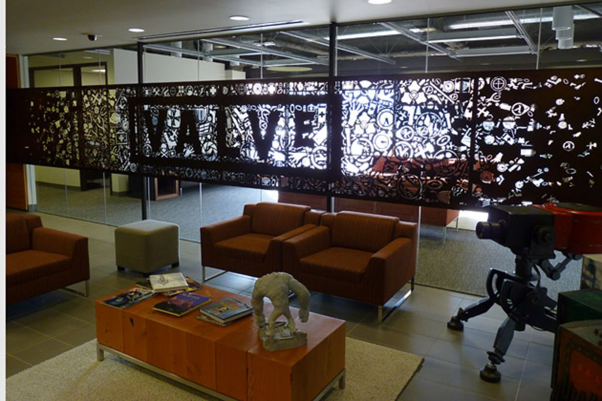
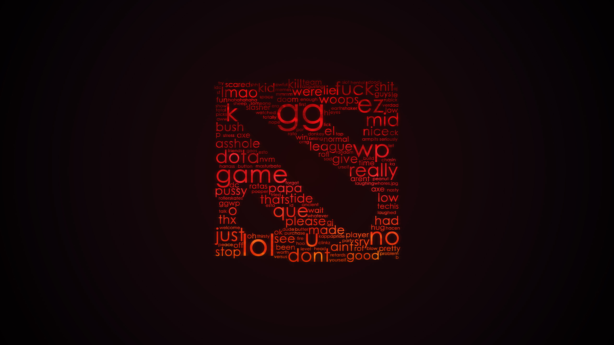
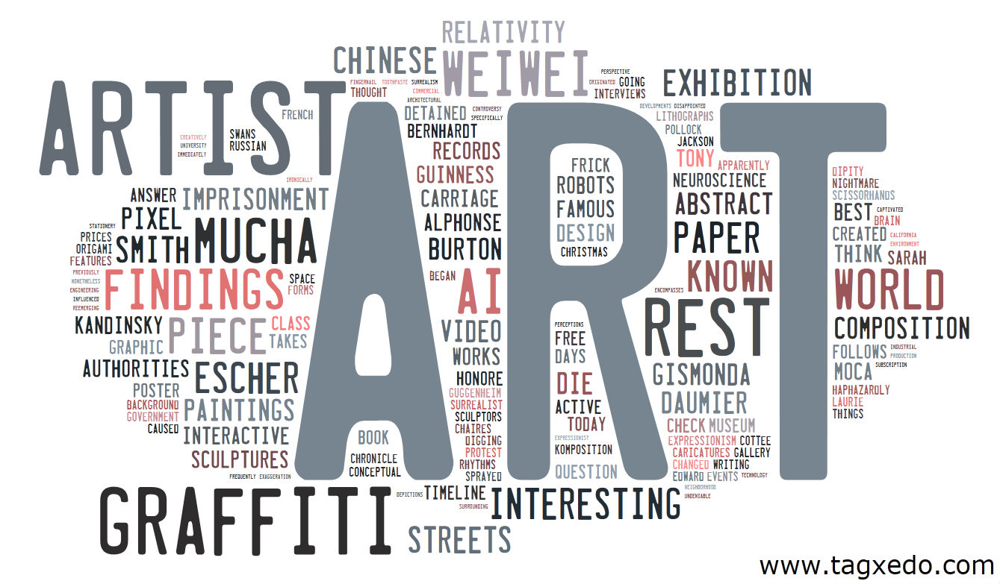

<<<<<<< HEAD
# aneura-graphic-clouds
Generator of word/image graphic clouds based on user input.
=======
# ANeura Explorations: Graphic Clouds

An object in the series of "graphic art"/"machine learning" explorations. The goal is to generate visually pleasing high resolution images containing word/image clouds based on the concept chosen by a user.

The project will consist of:

1. Interactive website which will:
  * Accept user input with the desired "concept" the user would like to map, along with the other parameters corresponding to the desired style/color/structure.
  * Frontend/backend communication to update the user on the exact stages of progress.
  * Small in-browser game to make that process less boring (since generating high resolutiong images may take quite a while)
  * Later a gallery of the best examples of the generated art.
2. Web-scraper to collect text/image data from the web that corresponds to the chosen "concept". Thus each request potentially can generate a slightly different cloud according to whatever is currently trending/viral.
3. Python script which will:
  * Create database entry for that user to log the process of the script on the backend and show it to the user on the frontend as the script progresses. 
  * Equalize the input data according to the color scheme (either preset or random based on color wheel and compliancy rules)
  * Map the obtained text and graphic data on the canvas to create a collage around or inside the base 'concept' (displayed as an actual word or a graphic mask)
  * Create at least two random variations with the same settings for the user to choose whichever is better and save both to the database along with all the other information about this request.
4. The resulting images along with the information about which are rejected/accepted will be collected and examined:
  * Manually, at the first stages when there won't be much data, in order to improve the actual image mapping/color changing algorythm.
  * By a neural network, when there is much more data, as an experiment to try to discover machine's idea of harmony and see how it performs on other inputs.

# Inspirations/references:

>>>>>>> 1e3cc39... Update README.md
